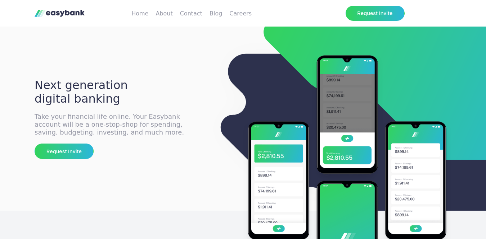

# Frontend Mentor - Easybank landing page solution

This is a solution to the [Easybank landing page challenge on Frontend Mentor](https://www.frontendmentor.io/challenges/easybank-landing-page-WaUhkoDN). Frontend Mentor challenges help you improve your coding skills by building realistic projects.

## Table of contents

- [Overview](#overview)
  - [The challenge](#the-challenge)
  - [Screenshot](#screenshot)
  - [Links](#links)
- [My process](#my-process)
  - [Built with](#built-with)
  - [What I learned](#what-i-learned)
- [Author](#author)

## Overview

### The challenge

Users should be able to:

- View the optimal layout for the site depending on their device's screen size
- See hover states for all interactive elements on the page

### Screenshot

### Links

- Solution URL: [easybank-github](https://github.com/realkevinbrian/EasyBank-landing-page)
- Live Site URL: [easybank.app](https://easybanking-app.vercel.app/)

## My process

### Built with

- Semantic HTML5 markup
- CSS custom properties
- Flexbox
- CSS Grid
- Mobile-first workflow
- [React](https://reactjs.org/) - JS library
- [Styled Components](https://styled-components.com/) - For styles

### What I learned

While building this project , i Learnt new ways of organizing content, write clean code, it helped me to improve my code architecture and solving UI problems.

## Author

- Website - [Kevin Brian](http://realkevinbrian.netlify.app/)
- Frontend Mentor - [@realkevinbrian](https://www.frontendmentor.io/profile/realkevinbrian)
- Twitter - [@realkevinbrian](https://www.twitter.com/realkevinbrian)
